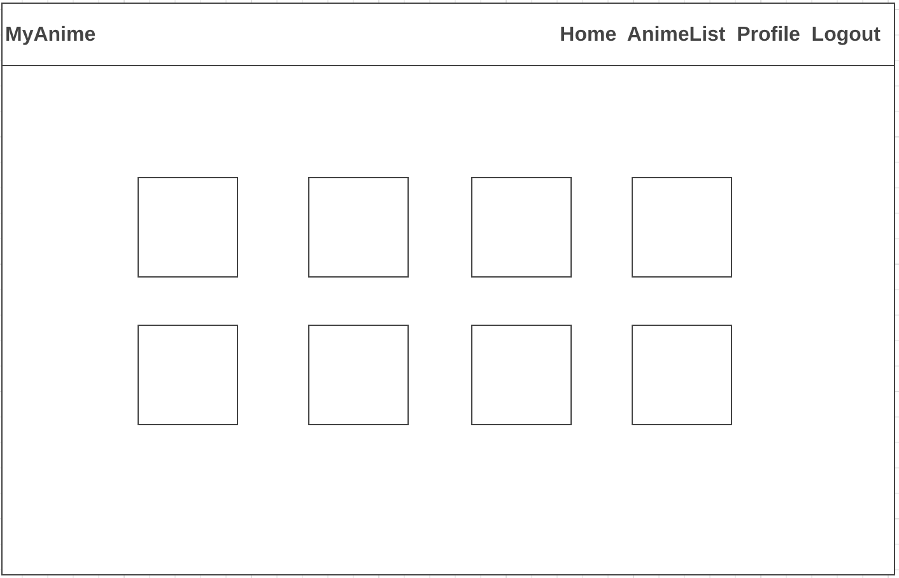

# MyAnime

by [AJRJ29](https://github.com/AJRJ29)

MyAnime app allows users to find their favorite anime in the app. Users can search for an anime, and then the app will display the list of anime names. Users can view information about the anime once they click the anime name. Users can also make a profile and save the anime for future reference.

## 1. Project Planning

### MVP

1. Search anime
2. Click an anime and show anime details
3. Bookmark an anime
4. Have a comment section
5. Styling

### Stretch Goals

1. Allows users to have a profile picture
2. More Styling
3. Have Popular anime in the home page

**Table: Users**

| Column| Type|
|------|------|
|Email |String|
|Name| String|
|Password| String|
|Image| String|

**Table: Anime**

| Column| Type|
|------|------|
|Name| String|
|UserId |String|

**Table: UsersAnime**

| Column| Type|
|------|------|
|UserID|Integer|
|AnimalID|Integer|

**Table: Comments**

| Column| Type|
|------|------|
|Name| String|
|Content| Text|
|AnimeId |String|

### Routing

_**GET**_

**/** - show the homepage

**/auth/register** - show a form to make a new account

**/auth/login** - show a form to log in

**/auth/logout** - log the user out and redirect to home

**/profile** - show a user's profile

**/anime/** - search an anime

**/anime/:name** - show anime details

_**POST**_

**/auth/register** - create a user in the database

**/auth/login** - use passport to authenticate the user

**/anime** - bookmark an anime to profile

**/comment/:id** - create a comment

_**DELETE**_

**/anime:name** - delete a bookmark 

### Wireframe

## 2. Technologies Used

**Node Modules** Axios, BCrypt, Flash, Dotenv, EJS, Express, Express EJS Layouts, Express Sessions, Helmet, Method Override, Morgan, Nodemon, Passport, Sequelize.

